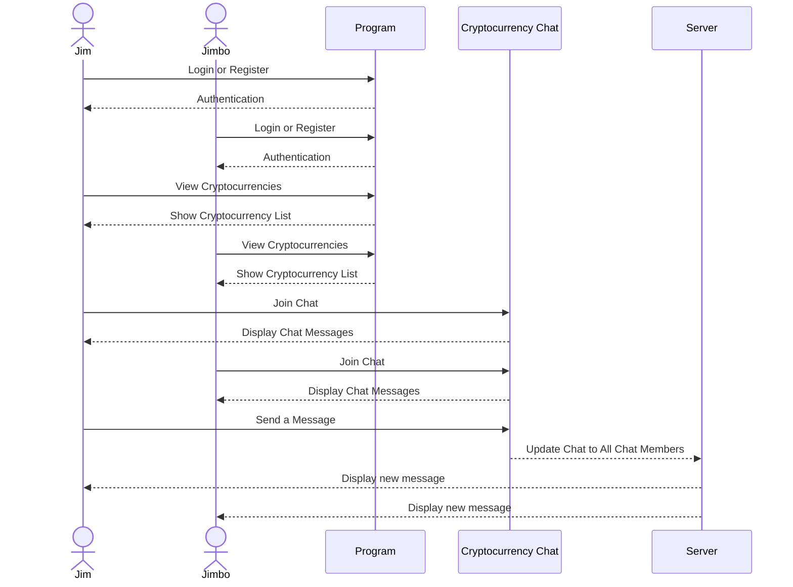

**CryptoHaven**

[My Notes](notes.md)

This project creates a website where people interested in cryptocurrency can come and converse about specific currencies.  It will allow people to track cryptocurrency in real time and discuss the cryptocurrencies with other people to figure out if it is worth investing in a certain currency.

> [!NOTE]
>  This is a template for your startup application. You must modify this `README.md` file for each phase of your development. You only need to fill in the section for each deliverable when that deliverable is submitted in Canvas. Without completing the section for a deliverable, the TA will not know what to look for when grading your submission. Feel free to add additional information to each deliverable description, but make sure you at least have the list of rubric items and a description of what you did for each item.

## 🚀 Specification Deliverable

For this deliverable I did the following. I checked the box `[x]` and added a description for things I completed.

- [X] Proper use of Markdown
- [X] A concise and compelling elevator pitch
- [X] Description of key features
- [X] Description of how you will use each technology
- [X] One or more rough sketches of your application. Images must be embedded in this file using Markdown image references.

### Elevator pitch

CryptoHaven is a website that will allow its users to track and converse about cryptocurrencies in real time.  It will allow people to talk about certain currencies and allow them to decide whether one is worth investing through help from others.  By combining live market data with community discussions, CryptoHaven allows users to make compelling decisions in a fast-paced world, as well as providing the tools to navigate the cryptocurrency market regardless of the user's experience.

### Design

Here is a sequence diagram that shows how users would interact with the backend to chat.

### Key features

- Secure login using HTTPS protocol.
- Uses an API called CoinGecko to get crypto information.
- Display of featured cryptocurrencies and their statistics.
- Ability to favorite certain crytocurrencies to always show them.
- Chat system for each cryptocurrency that allows users to communicate.

### Technologies

I am going to use the required technologies in the following ways.

- **HTML** - Create pages for login, dashboard, and chat rooms.
- **CSS** - Styling choices that make the site look appealing on different screen sizes with good color choice and object sizes.
- **JavaScript** - Provides login, pulls information from the CoinGecko API, and implements the ability to click a currency which sends the user to the chat and further information for that currency.
- **React** - Displays real-time updates for cryptocurrencies, ability to login, chat functionality, and displays new messages.
- **Service** - Backend service with endpoints for:
    - Login
    - Retrieving Currency Information
    - Sending Messages
    - Updating Chat for all Members
- **DB/Login** - Stores users and chat information in the database.  Credentials securely stored using password hashing.
- **WebSocket** - Enables real-time chat communication and shows new messages for each user, as well as communicates market data.

## 🚀 AWS deliverable

For this deliverable I did the following. I checked the box `[x]` and added a description for things I completed.

- [X] **Server deployed and accessible with custom domain name** - I signed up for AWS and started up the server that my code will display on.  Using Route 53 and EC2 I hosted my domain with the name vcoinchat.com.  Also, I made sure to use port 443 (HTTPS) to ensure a secure website connection and associated an elastic IP adress with the server. [My server link](https://vcoinchat.com/).

## 🚀 HTML deliverable

For this deliverable I did the following. I checked the box `[x]` and added a description for things I completed.

- [ ] **HTML pages** - I made 5 different HTML pages with the same header that navigates to each different page and a footer that has my GitHub repository in it.  There are pages for home, dashboard, login, signup, and chat.  Each of these pages do exactly what their name says.  
- [ ] **Proper HTML element usage** - I used proper body, nav, main, header, and footer elements in each of the pages that I have.  I have a navigation for the different links in the header, a footer for my GitHub link, and body and main tags that have information displayed inside of them.
- [ ] **Links** - I have links in my header that navigate to each different page making it easy to access every page of my website.
- [ ] **Text** - I have text that describes what my website does, some that navigates around the website, and some that displays content.
- [ ] **3rd party API placeholder** - I have a comment in my code, specifically in the chat.html file that shows exactly which div I will be using to gather information from my third party API, (CoinGecko)[https://www.coingecko.com/en/api].
- [ ] **Images** - I have images for a cryptocurrency display and an image that I plan to use for a background of my home page, but I can't yet because it is just purely HTML without any CSS.
- [ ] **Login placeholder** - I have login and signup pages that will be placeholders for actual login and signup abilities.  Also, I have a spot in the nav of my header specifically picked out for where I am going to be displaying the user's name.
- [ ] **DB data placeholder** - I have placeholders, set by comments, in multiple pages of my code,being the dashboard.html, login.html, signup.html, and to inser the user's account name in all pages.  These placeholders will pull information for each user and set them into divs or lists.
- [ ] **WebSocket placeholder** - I have a text box in my chat.html page that will be a placeholder for realtime communication.  I set this text box up so nobody can actually enter anything or delete anything from it.

## 🚀 CSS deliverable

For this deliverable I did the following. I checked the box `[x]` and added a description for things I completed.

- [ ] **Header, footer, and main content body** - I did not complete this part of the deliverable.
- [ ] **Navigation elements** - I did not complete this part of the deliverable.
- [ ] **Responsive to window resizing** - I did not complete this part of the deliverable.
- [ ] **Application elements** - I did not complete this part of the deliverable.
- [ ] **Application text content** - I did not complete this part of the deliverable.
- [ ] **Application images** - I did not complete this part of the deliverable.

## 🚀 React part 1: Routing deliverable

For this deliverable I did the following. I checked the box `[x]` and added a description for things I completed.

- [ ] **Bundled using Vite** - I did not complete this part of the deliverable.
- [ ] **Components** - I did not complete this part of the deliverable.
- [ ] **Router** - Routing between login and voting components.

## 🚀 React part 2: Reactivity

For this deliverable I did the following. I checked the box `[x]` and added a description for things I completed.

- [ ] **All functionality implemented or mocked out** - I did not complete this part of the deliverable.
- [ ] **Hooks** - I did not complete this part of the deliverable.

## 🚀 Service deliverable

For this deliverable I did the following. I checked the box [x] and added a description for things I completed.

- [ ] **Node.js/Express HTTP service** - I did not complete this part of the deliverable.
- [ ] **Static middleware for frontend** - I did not complete this part of the deliverable.
- [ ] **Calls to third party endpoints** - I did not complete this part of the deliverable.
- [ ] **Backend service endpoints** - I did not complete this part of the deliverable.
- [ ] **Frontend calls service endpoints** - I did not complete this part of the deliverable.
- [ ] **Supports registration, login, logout, and restricted endpoint** - I did not complete this part of the deliverable.

## 🚀 DB/Login deliverable

For this deliverable I did the following. I checked the box [x] and added a description for things I completed.

- [ ] **Stores data in MongoDB** - I did not complete this part of the deliverable.
- [ ] **Stores credentials in MongoDB** - I did not complete this part of the deliverable.
 
## 🚀 WebSocket deliverable

For this deliverable I did the following. I checked the box `[x]` and added a description for things I completed.

- [ ] **Backend listens for WebSocket connection** - I did not complete this part of the deliverable.
- [ ] **Frontend makes WebSocket connection** - I did not complete this part of the deliverable.
- [ ] **Data sent over WebSocket connection** - I did not complete this part of the deliverable.
- [ ] **WebSocket data displayed** - I did not complete this part of the deliverable.
- [ ] **Application is fully functional** - I did not complete this part of the deliverable.
