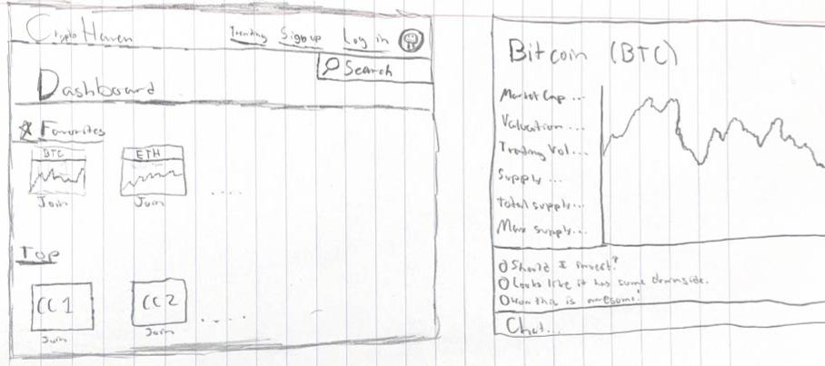

**CryptoHaven**

[My Notes](notes.md)

This project creates a website where people interested in cryptocurrency can come and converse about specific currencies.  It will allow people to track cryptocurrency in real time and discuss the cryptocurrencies with other people to figure out if it is worth investing in a certain currency.

> [!NOTE]
>  This is a template for your startup application. You must modify this `README.md` file for each phase of your development. You only need to fill in the section for each deliverable when that deliverable is submitted in Canvas. Without completing the section for a deliverable, the TA will not know what to look for when grading your submission. Feel free to add additional information to each deliverable description, but make sure you at least have the list of rubric items and a description of what you did for each item.

## 🚀 Specification Deliverable

For this deliverable I did the following. I checked the box `[x]` and added a description for things I completed.

- [X] Proper use of Markdown
- [X] A concise and compelling elevator pitch
- [X] Description of key features
- [X] Description of how you will use each technology
- [X] One or more rough sketches of your application. Images must be embedded in this file using Markdown image references.

### Elevator pitch

CryptoHaven is a website that will allow its users to track and converse about cryptocurrencies in real time.  It will allow people to talk about certain currencies and allow them to decide whether one is worth investing through help from others.  By combining live market data with community discussions, CryptoHaven allows users to make compelling decisions in a fast-paced world, as well as providing the tools to navigate the cryptocurrency market regardless of the user's experience.

### Design

Here is a sequence diagram that shows how users would interact with the backend to chat.

### Key features

- Secure login using HTTPS protocol.
- Uses an API called CoinGecko to get crypto information.
- Display of featured cryptocurrencies and their statistics.
- Ability to favorite certain crytocurrencies to always show them.
- Chat system for each cryptocurrency that allows users to communicate.

### Technologies

I am going to use the required technologies in the following ways.

- **HTML** - Create pages for login, dashboard, and chat rooms.
- **CSS** - Styling choices that make the site look appealing on different screen sizes with good color choice and object sizes.
- **JavaScript** - Provides login, pulls information from the CoinGecko API, and implements the ability to click a currency which sends the user to the chat and further information for that currency.
- **React** - Displays real-time updates for cryptocurrencies, ability to login, chat functionality, and displays new messages.
- **Service** - Backend service with endpoints for:
    - Login
    - Retrieving Currency Information
    - Sending Messages
    - Updating Chat for all Members
- **DB/Login** - Stores users and chat information in the database.  Credentials securely stored using password hashing.
- **WebSocket** - Enables real-time chat communication and shows new messages for each user, as well as communicates market data.

## 🚀 AWS deliverable

For this deliverable I did the following. I checked the box `[x]` and added a description for things I completed.

- [X] **Server deployed and accessible with custom domain name** - I signed up for AWS and started up the server that my code will display on.  Using Route 53 and EC2 I hosted my domain with the name vcoinchat.com.  Also, I made sure to use port 443 (HTTPS) to ensure a secure website connection and associated an elastic IP adress with the server. [My server link](https://vcoinchat.com/).

## 🚀 HTML deliverable

For this deliverable I did the following. I checked the box `[x]` and added a description for things I completed.

- [X] **HTML pages** - I made 5 different HTML pages with the same header that navigates to each different page and a footer that has my GitHub repository in it.  There are pages for home, dashboard, login, signup, and chat.  Each of these pages do exactly what their name says.  
- [X] **Proper HTML element usage** - I used proper body, nav, main, header, and footer elements in each of the pages that I have.  I have a navigation for the different links in the header, a footer for my GitHub link, and body and main tags that have information displayed inside of them.  Also, I used more elements like input fields, buttom, form, img, and more.
- [X] **Links** - I have links in my header that navigate to each different page making it easy to access every page of my website.
- [X] **Text** - I have text that describes what my website does, some that navigates around the website, and some that displays content.
- [X] **3rd party API placeholder** - I have a comment in my code, specifically in the chat.html file that shows exactly which div I will be using to gather information from my third party API, [CoinGecko](https://www.coingecko.com/en/api).
- [X] **Images** - I have images for a cryptocurrency display and an image that I plan to use for a background of my home page, but I can't yet because it is just purely HTML without any CSS.
- [X] **Login placeholder** - I have login and signup pages that will be placeholders for actual login and signup abilities.  Also, I have a spot in the nav of my header specifically picked out for where I am going to be displaying the user's name.
- [X] **DB data placeholder** - I have placeholders, set by comments, in multiple pages of my code,being the dashboard.html, login.html, signup.html, and to inser the user's account name in all pages.  These placeholders will pull information for each user and set them into divs or lists.
- [X] **WebSocket placeholder** - I have a text box in my chat.html page that will be a placeholder for realtime communication.  I set this text box up so nobody can actually enter anything or delete anything from it.

## 🚀 CSS deliverable

For this deliverable I did the following. I checked the box `[x]` and added a description for things I completed.

- [X] **Header, footer, and main content body** - For this, I made a header for each page that displays what type of page it is on, and a content body that has all the information for a page on it.  I then have a footer that shows the different pages that a user can go onto in the website.  I have two files, homestyle.css for the homepage and styles.css for each of the other 4 pages.
- [X] **Navigation elements** - I used the bootstrap navbar that made making the navigation a lot easier.
- [X] **Responsive to window resizing** - I used the Bootstrap resizing features and the 'display:flex" that made my page be responsive to any page size.
- [X] **Application elements** - For my elements I used a lot of different sizing ideas such as the bootstrap built in columns and view width properties.  Also, I used a lot of "display:flex" to make the page look nice.
- [X] **Application text content** - I imported a text font named OpenSans that looks really nice on the front page.  For all the other pages I kept the font the same.  I used a lot of centering styles to make the code stay in the middle to look nicer.
- [X] **Application images** - I used an image on the homepage as a background for my page.  It has a cryptocurrency graph and it matches very well with the website.

## 🚀 React part 1: Routing deliverable

For this deliverable I did the following. I checked the box `[x]` and added a description for things I completed.

- [X] **Bundled using Vite** - I bundled my server with Vite so I can test it remotely and use React to display my code.
- [X] **Components** - I made componenets for each different page of my application,  There are different components for login, sign-up, dashboard, chatroom, and home page.  I also made a component for the cryptocurrency table that I will display on the chatroom and dashboard.  Also, I made a sidebar component so I didn't have to copy the code for every single page.
- [X] **Router** - I implemented routing in my App.jsx so that the entire website can be routed through a single page just switching the components.

## 🚀 React part 2: Reactivity

For this deliverable I did the following. I checked the box `[x]` and added a description for things I completed.

- [X] **All functionality implemented or mocked out** - I completed this part of the deliverable.  I added my third-party data pull to the CoinGecko API to get current information about cryptocurrencies.  Then, I take that data and display it in a table for users to look at.  Further, I made a way for the user to click a given cryptocurrency and see all relevant information about it.  The user is also allowed to favorite it, allowing the specific cryptocurrency's price and name to be shown in their dashboard.  I also implemented a signup feature that hashes users' passwords in local storage.  There is a login feature to go along with it aswell.  If a user tries to go to any given page without logging in, it will re-route them to the signup/login pages.  Also, a user is allowed to chat with other users through the chatroom's message system.  
- [X] **Hooks** - I added multiple useState and useEffect hooks to keep track of important data, such as message history, account name, favorite cryptocurrencies, etc.  This allowed me to effectively collect data from the user's actions and store it for further use.

## 🚀 Service deliverable

For this deliverable I did the following. I checked the box [x] and added a description for things I completed.

- [X] **Node.js/Express HTTP service** - I installed express with npm and ran the service on port 3000.
- [X] **Static middleware for frontend** - I made enpoints in my service/index.js file to make sure people had the right authorization for ports that required information to be passed back.
- [X] **Calls to third party endpoints** - I called my third party API, CoinGecko, in my code and pass it into the service for secure storage.
- [X] **Backend service endpoints** - I made endpoints for message display, updating messages, getting cryptoData, setting cryptoData, and updating and displaying favorite crypto information.
- [X] **Frontend calls service endpoints** - I removed all functionality from the front end and replaced it with all the needed functionality in the service index file.  
- [X] **Supports registration, login, logout, and restricted endpoint** - I made a get function for login, a post function for signup, and a delete function for logout.  Logout requires you to be authorized and most other endpoints are that way aswell.

## 🚀 DB/Login deliverable

For this deliverable I did the following. I checked the box [x] and added a description for things I completed.

- [X] **Stores data in MongoDB** - I store all of the users and all information needed for them, crypto data, and all the messages in my MongoDB database.  All of the connection and input/output in the database is done through service/index.js
- [X] **Stores credentials in MongoDB** - I stored all of the credentials needed in my user table including usernaame, session ID, and their hashed password.  This is done in service/index.js.
 
## 🚀 WebSocket deliverable

For this deliverable I did the following. I checked the box `[x]` and added a description for things I completed.

- [X] **Backend listens for WebSocket connection** - I make a socket.js file that listens for messages that are coming through the connection.  It also every 30 seconds pings every single user to check if they are still connected to the website.  If they are, they are kept in the client list, if not, they are removed.  Also, new connections are added to the client list.
- [X] **Frontend makes WebSocket connection** - I made a chatNotifier.js file that listens for new connections in WebSocket.  It will then show in the chat that a new user has connected to the chat for everybody else.
- [X] **Data sent over WebSocket connection** - I send chat messages over WebSocket from the front end to the back end.  The process is as listed.  Firstly, the user sends a message in the chat.  Then, the backend will recieve the message and forward it to all of the other connected user's WebSocket connection, which will then update the chat for all users.
- [X] **WebSocket data displayed** - When a message is passed to each user for the system to update, it will call a function to reset the message list, which will then dynamically update the chat box, which will show the new message.
- [X] **Application is fully functional** - My application has login, signup, chatting, and browsing ability that makes the website fully functional.  People are able to chat with each other and look at a lot of different cryptocurrencies.
